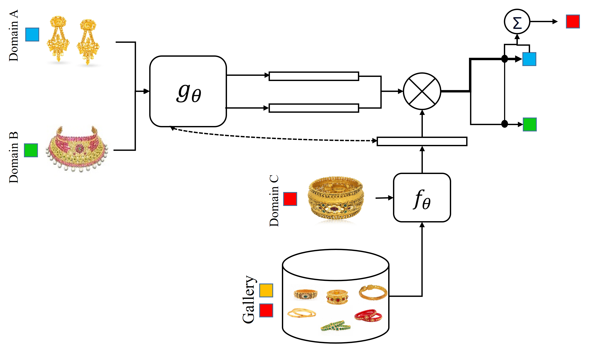

### Publication
Ornament image retrieval using few-shot learning, 
By : Sk Maidul Islam, Subhankar Joardar, and Arif Ahmed Sekh

[Link to The Paper](https://doi.org/10.1007/s13735-023-00299-0)

### Dataset Description
We introduce OrnamentFIR, a novel ornament dataset related to the fashion industry. 
### License

Copyright © 2023 Sk Maidul Islam

The content of this repository is bound by the following licenses:

- The documents and data are licensed under the MIT license.
